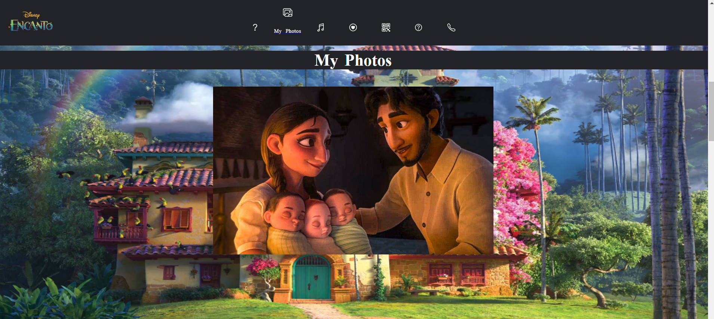
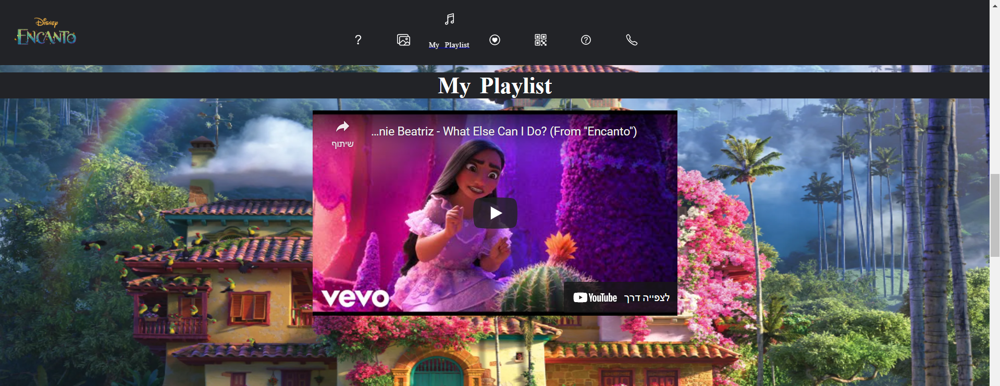
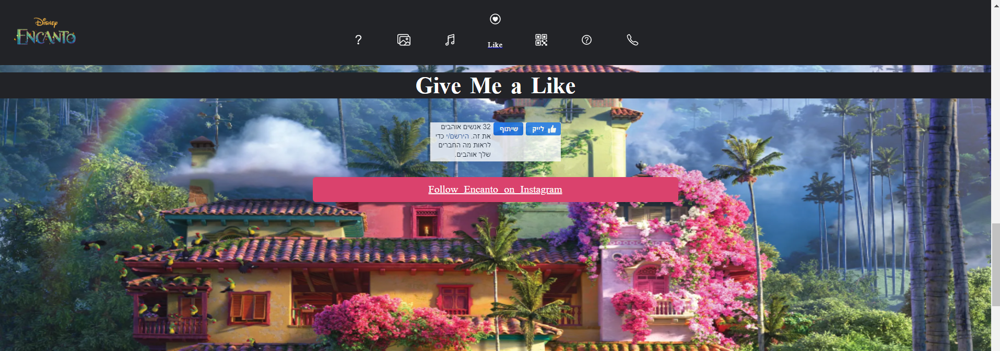
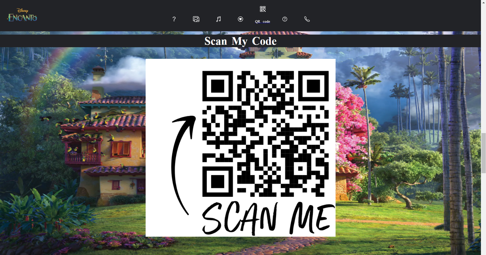

# Third Age Website About Alma Madrigal

## Overview

This is a simple website, mainly HTML, css and a few Javascript script codes. I did my website on the cartoon Alma Madrigal from the Disney movie Encanto.

## What's the site contains?

- **About Me** - a short history about Alma Madrigal from the movie.

  

- **My Photos** - a auto changing every 2.5 seconds slideshow with photos Alma Madrigal.

  

- **My Playlist** - the playlist of all the songs from Encanto movie.

  

- **Like** - Like button connected Encanto fan facebook page and a button to follow Encanto Instagram Page.

  

- **QR Code** - a QR Code that leads to this assignment's url.

  

- **Q&A** - answers to 2 questions that were given in the assignment.

  

- **Contact Me** - a form to write to my mail, there is a smiley face that if pressed will open a small window with a variety of smileis.

  

## Website URL of the actual assignment:

https://web-development-environments-2021.github.io/205963135.io/

## ID:

205963135

## Full Name:

Maor Biton Dor
